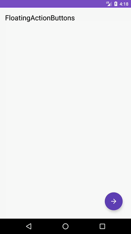
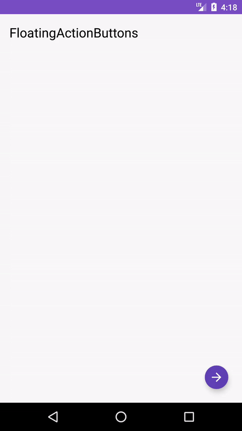
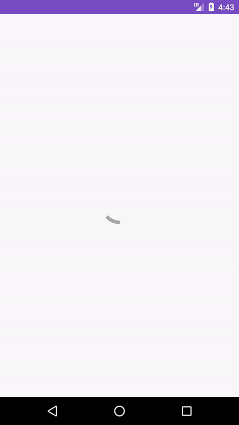
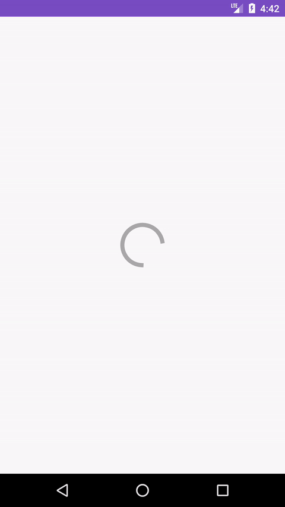

Reactive Components
===================

A collection of components featuring a loading / in progress state. Includes RxJava lifecycle tie-in.

Example usage
-------------

__RecyclerView:__

```xml

<lu.aqu.reactivecomponents.ReactiveRecyclerView xmlns:android="http://schemas.android.com/apk/res/android"
    xmlns:app="http://schemas.android.com/apk/res-auto"
    android:id="@+id/my_recycler_view"
    android:layout_width="match_parent"
    android:layout_height="match_parent"
    android:orientation="vertical"
    android:scrollbars="vertical"
    app:emptyText="Wow, this looks empty!"
    app:emptyTextSize="24sp"
    app:layoutManager="android.support.v7.widget.LinearLayoutManager" />

```

Tied into Retrofit / RxJava request:

```java

final ReactiveRecyclerView myRecyclerView = (ReactiveRecyclerView) findViewById(R.id.my_recycler_view);
service.getHouses()
	.compose(ReactiveTransformer.<List<House>>bind(myRecyclerView))
	.subscribe(new Consumer<List<House>>() {
	    @Override
	    public void accept(@NonNull List<House> houses) throws Exception {
		Log.i(LOG_TAG, "request succeeded!");
		myRecyclerView.setAdapter(new HouseCardAdapter(houses));
	    }
	}, new Consumer<Throwable>() {
	    @Override
	    public void accept(Throwable throwable) throws Exception {
		Log.e(LOG_TAG, "request failed");
	    }
	});

```

Options:

| Attribute | Values | Description | Default value |
| --------- | ------ | ----------- | ------------- |
| `app:emptyText` | string | text to be displayed, when adapter is empty | none |
| `app:emptyTextSize` | dimension | the textsize for the empty view | default text size |
| `app:emptyDrawable` | drawable | a drawable to be displayed, when adapter is empty | none |
| `app:autoShowProgress` | boolean | whether or not the loading state shall be displayed automatically | true |
| `app:autoHideProgress` | boolean | whether or not the loading state shall be hidden automatically (after Rx calls and when adapter is set) | true |

Per default, the recyclerview will switch from loadingstate to displaying the user-supplied adapter (or the empty view) as soon as "setAdapter" is invoked.
If emptyText and emptyDrawable both are set, the emptyText will be displayed underneath the drawable.

__FloatingActionButton:__


```xml

<lu.aqu.reactivecomponents.ReactiveFloatingActionButton
    android:id="@+id/fab"
    android:layout_width="wrap_content"
    android:layout_height="wrap_content"
    app:backgroundColor="@color/colorPrimaryDark"
    app:src="@drawable/ic_arrow_forward_white_24dp" />

<lu.aqu.reactivecomponents.ReactiveFloatingActionButton
    android:id="@+id/mini_fab"
    android:layout_width="wrap_content"
    android:layout_height="wrap_content"
    app:backgroundColor="@color/colorPrimaryDark"
    app:loadingFabSize="mini"
    app:src="@drawable/ic_arrow_forward_white_24dp" />

```
Options:

| Attribute | Values | Description | Default value |
| --------- | ------ | ----------- | ------------- |
| `app:src` | drawable | icon to be displayed in FAB | none |
| `app:backgroundColor` | color | (single) background color | ?attr/colorPrimaryDark |
| `app:disabledWhileLoading` | boolean | whether or not the button is disabled while in loading state | false (enabled while loading) |
| `app:clickableWhileLoading` | boolean | whether or not the button shall be clickable when in loading state | false (not clickable) |
| `app:disabledAlpha` | float | opacity of the FAB when disabled | 0.65f |
| `app:loadingFabSize` | mini / normal | the size of the FAB | normal |

The floating action button's loading state can either manually be controlled by invoking "fab.setIsLoading(true)" or tied into the RxJava / Retrofit request lifecycle.


__Image Gallery:__

```xml

<lu.aqu.reactivecomponents.ReactiveGallery
    android:id="@+id/gallery"
    android:layout_width="match_parent"
    android:layout_height="300dp"
    app:indicatorActive="@drawable/page_indicator_dots_selected"
    app:indicatorInactive="@drawable/page_indicator_dots_not_selected" />
```

Options:

| Attribute | Values | Description | Default value |
| --------- | ------ | ----------- | ------------- |
| `app:indicatorSpacing` | dimen | spacing between page indicators | 4dp |
| `app:indicatorActive` | drawable | indicator for currently active page | circle with 8dp diameter of color ?attr/colorPrimary |
| `app:indicatorInactive` | drawable | indicator for inactive page | circle with 6dp diameter of color @android:color/darker_gray |

An Image Gallery with lazy loading and left / right swiping support.

To load an image, a ReactiveGallery.ImageLoader instance must be set on the ReactiveGallery instance.
Example with Glide:

```java

    @Override
    protected void onCreate(Bundle savedInstanceState) {
        ReactiveGallery gallery = (ReactiveGallery) findViewById(R.id.gallery);

        imageSwitcher.setImageLoader(new ReactiveGallery.ImageLoader() {
            @Override
            public void loadImage(String url, final ReactiveGallery.LoadingCallback callback) {
                Glide.with(ExampleActivity.this)
                        .load(new GlideUrl(url))
                        .asBitmap()
                        .centerCrop()
                        .skipMemoryCache(true)
                        .diskCacheStrategy(DiskCacheStrategy.NONE)
                        .into(new SimpleTarget<Bitmap>() {
                            @Override
                            public void onResourceReady(Bitmap resource, GlideAnimation<? super Bitmap> glideAnimation) {
                                callback.onLoadFinished(new BitmapDrawable(getResources(), resource));
                            }
                        });
            }
        });
   }

```

Download
--------

add jitpack to your project's repositories (project level build.gradle file):

```groovy

allprojects {
    repositories {
        ...
        maven { url "https://jitpack.io" }
    }
}

```


and add the following to your app level's build.gradle dependencies:

```groovy

dependencies {
  implementation 'com.github.aqulu:reactive-components:0.2.0'
}

```


Showcase
--------

__Floating Action Button (normal)__



__Floating Action Button (mini)__



__Recycler View__




